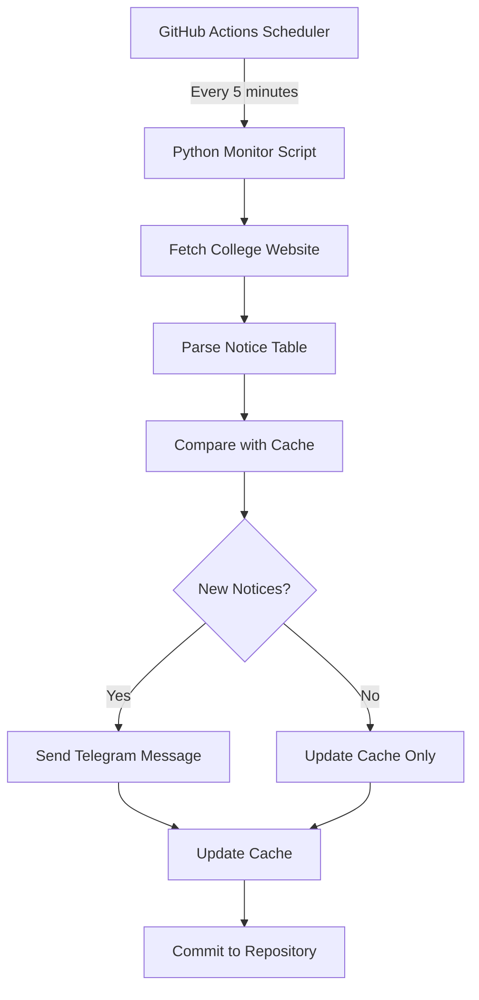

# 🎓 Dhaka College Notice Monitor

[](https://github.com/iqtidar314/Dhaka-College-Notice-Update/actions)
[](https://www.python.org/downloads/release/python-390/)
[](https://opensource.org/licenses/MIT)

An automated monitoring system that tracks new notices from [Dhaka College](https://www.dhakacollege.edu.bd/en/notice) and sends instant Telegram notifications. Built with GitHub Actions for 24/7 monitoring with zero infrastructure costs.

## 🚀 Features

- ✅ **Real-time Monitoring**: Checks for new notices every 5 minutes
- ✅ **Smart Detection**: Only sends notifications for genuinely new notices
- ✅ **Telegram Integration**: Instant notifications with download links
- ✅ **Persistent Caching**: Remembers previous notices across runs
- ✅ **Performance Optimized**: Virtual environment caching reduces runtime by 70%
- ✅ **Zero Cost**: Runs entirely on GitHub Actions free tier
- ✅ **Manual Override**: Supports manual trigger and cache editing
- ✅ **Error Handling**: Robust error handling with detailed logging

## 📱 Sample Notification

```
🔔 New Notice(s) from Dhaka College!

1. একাদশ(২০২৪-২৫) শ্রেণির পুনঃপুনঃবার্ষিক পরীক্ষার সময়সূচী।
📅 Date: 27-08-2025
📎 Download PDF

2. দ্বাদশ শ্রেণির বার্ষিক পরীক্ষার ফলাফল প্রকাশ
📅 Date: 26-08-2025
📎 Download PDF

🕐 Checked at: 2025-08-28 15:30:45
🌐 View All Notices
```

## 🏗️ Architecture



## 🛠️ Setup Guide

### Prerequisites

1. **Telegram Bot Token** - Create via [@BotFather](https://t.me/BotFather)
2. **Telegram Chat ID** - Your personal chat ID
3. **GitHub Repository** - Fork or create this repository

### Step 1: Create Telegram Bot

1. Message [@BotFather](https://t.me/BotFather) on Telegram
2. Send `/newbot` and follow the instructions
3. Save the bot token (format: `123456789:ABCdefGhIJKlmNoPQRsTUVwxyZ`)
4. Send `/start` to your new bot

### Step 2: Get Your Chat ID

**Method A: Using Bot**
1. Send any message to your bot
2. Visit: `https://api.telegram.org/bot<YOUR_BOT_TOKEN>/getUpdates`
3. Find your chat ID in the JSON response

**Method B: Using @userinfobot**
1. Message [@userinfobot](https://t.me/userinfobot)
2. Copy your ID (numeric value)

### Step 3: Configure Repository Secrets

1. Go to your repository → **Settings** → **Secrets and variables** → **Actions**
2. Click **New repository secret** and add:
   - **Name**: `TELEGRAM_TOKEN` **Value**: Your bot token
   - **Name**: `TELEGRAM_CHAT_ID` **Value**: Your chat ID

### Step 4: Setup Repository Files

Create the following file structure in your repository:

```
your-repository/
├── .github/
│   └── workflows/
│       └── monitor.yml          # GitHub Actions workflow
├── monitor.py                   # Main monitoring script
├── requirements.txt             # Python dependencies
├── notice_cache.json           # Cache file (auto-generated)
└── README.md                   # This file
```

### Step 5: Deploy Files

Copy the following files to your repository:

**`.github/workflows/monitor.yml`**
```yaml
name: College Notice Monitor
on:
  schedule:
    - cron: '*/5 * * * *'  # Every 5 minutes
  workflow_dispatch:  # Manual trigger

jobs:
  monitor:
    runs-on: ubuntu-latest
    
    steps:
    - name: Checkout repository
      uses: actions/checkout@v4
      with:
        token: ${{ secrets.GITHUB_TOKEN }}
    
    - name: Set up Python
      uses: actions/setup-python@v4
      with:
        python-version: '3.9'
    
    - name: Cache Python virtual environment
      uses: actions/cache@v3
      with:
        path: venv
        key: ${{ runner.os }}-venv-python3.9-${{ hashFiles('**/requirements.txt') }}
        restore-keys: |
          ${{ runner.os }}-venv-python3.9-
    
    - name: Install dependencies
      run: |
        if [ ! -d "venv" ]; then
          echo "Creating virtual environment and installing dependencies"
          python -m venv venv
          source venv/bin/activate
          pip install --upgrade pip
          pip install -r requirements.txt
        else
          echo "Using cached virtual environment"
        fi
        source venv/bin/activate
        echo "VIRTUAL_ENV=$VIRTUAL_ENV" >> $GITHUB_ENV
        echo "$VIRTUAL_ENV/bin" >> $GITHUB_PATH
    
    - name: Load notice cache
      uses: actions/cache@v3
      with:
        path: notice_cache.json
        key: notice-cache-${{ github.run_id }}
        restore-keys: notice-cache-
    
    - name: Run notice monitor
      env:
        TELEGRAM_TOKEN: ${{ secrets.TELEGRAM_TOKEN }}
        TELEGRAM_CHAT_ID: ${{ secrets.TELEGRAM_CHAT_ID }}
      run: python monitor.py
    
    - name: Commit and push cache changes
      run: |
        git config --local user.email "action@github.com"
        git config --local user.name "GitHub Action"
        git add notice_cache.json
        git diff --staged --quiet || git commit -m "Update notice cache - $(date)"
        git push || echo "No changes to push"
```

**`requirements.txt`**
```
requests==2.31.0
beautifulsoup4==4.12.2
lxml==4.9.3
```

**`monitor.py`** - Copy the Python script from your document

### Step 6: Test the Setup

1. Go to **Actions** tab in your repository
2. Select **College Notice Monitor** workflow
3. Click **Run workflow** → **Run workflow**
4. Check if you receive a test notification

## ⚙️ Configuration Options

### Monitoring Frequency

Edit the cron expression in `.github/workflows/monitor.yml`:

```yaml
schedule:
  - cron: '*/5 * * * *'   # Every 5 minutes
  - cron: '*/10 * * * *'  # Every 10 minutes
  - cron: '0 * * * *'     # Every hour
  - cron: '0 8,17 * * *'  # 8 AM and 5 PM daily
```

### Notice Limit

Modify the `get_new_notices` method in `monitor.py`:

```python
# Return latest 3 new notices
return new_notices[:3]  # Change 3 to your desired limit
```

### Custom Selectors

Update the CSS selector in `parse_notices` method for different websites:

```python
selector = "your-custom-css-selector"
```

## 📊 Performance Metrics

| Metric | Value |
|--------|-------|
| Average Runtime | ~8 seconds |
| Cold Start (First Run) | ~13 seconds |
| Cached Run | ~6 seconds |
| Dependency Installation | ~1.5 seconds (cached) |
| GitHub Actions Usage | ~2.5 minutes/day |
| Monthly Cost | **FREE** (within 2000 minutes limit) |

## 🔧 Troubleshooting

### Common Issues

**1. No Notifications Received**
- ✅ Verify bot token and chat ID in repository secrets
- ✅ Check if bot is started (send `/start` to your bot)
- ✅ Review Actions logs for errors

**2. Workflow Failing**
- ✅ Check Python script filename matches workflow (`monitor.py`)
- ✅ Verify `requirements.txt` is present
- ✅ Check repository permissions for Actions

**3. Duplicate Notifications**
- ✅ Clear Actions cache: Repository → Actions → Caches → Delete all
- ✅ Check `notice_cache.json` format
- ✅ Verify notice ID generation logic

**4. Cache Issues**
- ✅ Manually edit `notice_cache.json` in repository
- ✅ Delete Actions cache to force refresh
- ✅ Check cache file permissions

### Debug Mode

Enable verbose logging by adding to `monitor.py`:

```python
import logging
logging.basicConfig(level=logging.DEBUG)
```

### Manual Cache Reset

Create/edit `notice_cache.json` in repository:

```json
{
  "notices": [],
  "last_check": null
}
```

## 📈 Monitoring Dashboard

Track your monitor's performance:

1. **Actions Tab**: View run history and logs
2. **Insights → Actions**: Monitor usage and trends  
3. **Settings → Actions**: Manage workflow permissions

## 🔐 Security Features

- ✅ **Secrets Management**: Sensitive data stored in GitHub Secrets
- ✅ **Token Validation**: Environment variable validation
- ✅ **Error Isolation**: Failures don't expose credentials
- ✅ **Repository Permissions**: Minimal required permissions

## 🤝 Contributing

1. Fork the repository
2. Create a feature branch (`git checkout -b feature/AmazingFeature`)
3. Commit changes (`git commit -m 'Add AmazingFeature'`)
4. Push to branch (`git push origin feature/AmazingFeature`)
5. Open a Pull Request

## 📄 License

This project is licensed under the MIT License - see the [LICENSE](LICENSE) file for details.

## 🙏 Acknowledgments

- [Dhaka College](https://www.dhakacollege.edu.bd/) for providing the notice board
- [Telegram Bot API](https://core.telegram.org/bots/api) for messaging platform
- [GitHub Actions](https://github.com/features/actions) for free automation
- [Beautiful Soup](https://www.crummy.com/software/BeautifulSoup/) for HTML parsing

## 📞 Support

- 🐛 **Bug Reports**: [Create an Issue](../../issues)
- 💡 **Feature Requests**: [Create an Issue](../../issues)
- 📚 **Documentation**: Check this README
- 💬 **Discussions**: [GitHub Discussions](../../discussions)

---

**Made with ❤️ for Dhaka College students**

*Last Updated: August 28, 2025*
