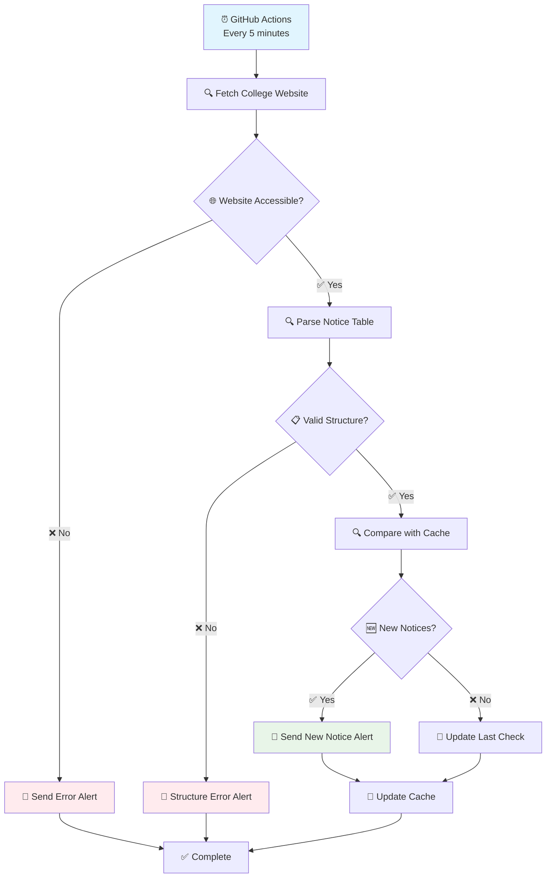

# 🎓 Dhaka College Notice Monitor

<div align="center">


<h2>🚨 Never miss an important notice from Dhaka College again! 🚨</h2>

<h3>🤖 An intelligent, automated monitoring system that tracks new notices from <a href="https://www.dhakacollege.edu.bd/en/notice">Dhaka College's official website</a> and delivers instant notifications to your Telegram. 📱</h3>

<div style="background: linear-gradient(90deg, #667eea 0%, #764ba2 100%); padding: 20px; border-radius: 15px; margin: 20px 0;">
  <h3 style="color: white; margin: 0;">
    <a href="#-quick-setup" style="color: #fff; text-decoration: none;">🚀 Quick Setup</a> • 
    <a href="#-features" style="color: #fff; text-decoration: none;">📋 Features</a> • 
    <a href="#️-configuration" style="color: #fff; text-decoration: none;">⚙️ Configuration</a> • 
    <a href="#️-troubleshooting" style="color: #fff; text-decoration: none;">🛠️ Troubleshooting</a>
  </h3>
</div>

</div>

---

## ✨ Features

<div style="background: #f8f9fa; padding: 25px; border-radius: 15px; border-left: 5px solid #007bff;">

<table style="width: 100%; border-collapse: collapse;">
  <tr style="background: linear-gradient(135deg, #667eea 0%, #764ba2 100%); color: white;">
    <th style="padding: 15px; text-align: center; font-size: 18px;">Icon</th>
    <th style="padding: 15px; text-align: left; font-size: 18px;">Feature</th>
  </tr>
  <tr style="background: #e3f2fd; border-bottom: 2px solid #2196F3;">
    <td align="center" style="padding: 15px; font-size: 24px;">⚡</td>
    <td style="padding: 15px;"><strong style="color: #1976D2; font-size: 16px;">Real-time Monitoring</strong><br/><em>Checks for new notices every 5 minutes using GitHub Actions</em></td>
  </tr>
  <tr style="background: #f3e5f5; border-bottom: 2px solid #9C27B0;">
    <td align="center" style="padding: 15px; font-size: 24px;">🤖</td>
    <td style="padding: 15px;"><strong style="color: #7B1FA2; font-size: 16px;">Intelligent Parsing</strong><br/><em>Robust HTML parsing with multiple fallback mechanisms</em></td>
  </tr>
  <tr style="background: #e8f5e8; border-bottom: 2px solid #4CAF50;">
    <td align="center" style="padding: 15px; font-size: 24px;">📱</td>
    <td style="padding: 15px;"><strong style="color: #388E3C; font-size: 16px;">Instant Telegram Notifications</strong><br/><em>Get notified immediately when new notices are published</em></td>
  </tr>
  <tr style="background: #fff3e0; border-bottom: 2px solid #FF9800;">
    <td align="center" style="padding: 15px; font-size: 24px;">🛡️</td>
    <td style="padding: 15px;"><strong style="color: #F57C00; font-size: 16px;">Error Resilience</strong><br/><em>Comprehensive error handling with smart recovery</em></td>
  </tr>
  <tr style="background: #fce4ec; border-bottom: 2px solid #E91E63;">
    <td align="center" style="padding: 15px; font-size: 24px;">💾</td>
    <td style="padding: 15px;"><strong style="color: #C2185B; font-size: 16px;">Smart Caching</strong><br/><em>Efficient duplicate detection and state management</em></td>
  </tr>
  <tr style="background: #e0f2f1; border-bottom: 2px solid #009688;">
    <td align="center" style="padding: 15px; font-size: 24px;">🔧</td>
    <td style="padding: 15px;"><strong style="color: #00695C; font-size: 16px;">Zero Maintenance</strong><br/><em>Adapts to website changes automatically</em></td>
  </tr>
</table>

</div>

---

## 🚀 Quick Setup

> ### 🎯 **Ready to get started? Follow these 4 simple steps and you'll be monitoring notices in under 10 minutes!** 

<div style="background: linear-gradient(135deg, #ff6b6b 0%, #ee5a24 100%); color: white; padding: 20px; border-radius: 15px; margin: 20px 0;">
  <h3 style="margin: 0; color: white;">⚠️ IMPORTANT: Complete ALL steps in order for the system to work properly!</h3>
</div>

### 📱 Step 1: Create Your Telegram Bot

<details style="background: #e3f2fd; padding: 15px; border-radius: 10px; border-left: 5px solid #2196F3;">
<summary><strong style="font-size: 18px; color: #1976D2;">📱 Click here for detailed Telegram setup</strong></summary>

1. **Create a new bot:**
   - Open Telegram and search for `@BotFather`
   - Send the command: `/newbot`
   - Choose a name for your bot (e.g., "Dhaka College Monitor")
   - Choose a username (e.g., "dhaka_college_monitor_bot")
   - **Save your Bot Token** (format: `123456789:ABCdefGhIJKlmNoPQRsTuVwXYz`)

2. **Get your Chat ID:**
   - Start a conversation with your newly created bot
   - Send any message (e.g., "Hello")
   - Visit this URL in your browser:
     ```
     https://api.telegram.org/bot<YOUR_BOT_TOKEN>/getUpdates
     ```
   - Replace `<YOUR_BOT_TOKEN>` with your actual token
   - Look for `"chat":{"id":` in the JSON response
   - **Save this Chat ID** (it's usually a number like `123456789`)

</details>

### ⚙️ Step 2: Set Up Your Repository

<div style="background: #f8f9fa; padding: 20px; border-radius: 10px; border-left: 5px solid #28a745;">

**1. Fork this repository** to your GitHub account
   - 👆 Click the **"Fork"** button at the top right of this page
   
**2. Enable GitHub Actions:**
   - 🔧 Go to your forked repository
   - 📊 Click on the `Actions` tab
   - ✅ Click `I understand my workflows, go ahead and enable them`

**3. Configure Repository Settings:**
   - ⚙️ Go to `Settings` → `Actions` → `General`
   - 🔓 Under "Workflow permissions", select `Read and write permissions`
   - ☑️ Check `Allow GitHub Actions to create and approve pull requests`

</div>

### 🔐 Step 3: Add Your Secrets

<details style="background: #fff3cd; padding: 15px; border-radius: 10px; border-left: 5px solid #ffc107;">
<summary><strong style="font-size: 18px; color: #856404;">🔐 Click here for secrets configuration</strong></summary>

1. In your forked repository, go to `Settings` → `Secrets and variables` → `Actions`
2. Click `New repository secret` and add these two secrets:

| Secret Name | Value | Description |
|-------------|-------|-------------|
| `TELEGRAM_TOKEN` | Your bot token from Step 1 | Used to send messages via your bot |
| `TELEGRAM_CHAT_ID` | Your chat ID from Step 1 | Specifies where to send notifications |

⚠️ **Important:** Make sure there are no extra spaces or characters in your secrets!

</details>

### Step 4: Test Your Setup

1. **Manual Test:**
   - Go to the `Actions` tab in your repository
   - Click on `College Notice Monitor`
   - Click `Run workflow` → `Run workflow`
   - Wait for the green checkmark ✅

2. **Verify Telegram Notification:**
   - Check your Telegram chat for a test message
   - If you don't receive anything, check the Actions logs for errors

---

## 📊 How It Works



---

## ⚙️ Configuration

### 🕐 Monitoring Schedule

The default schedule runs every 5 minutes. You can customize this by editing `.github/workflows/monitor.yml`:

```yaml
schedule:
  - cron: '*/5 * * * *'    # Every 5 minutes (default)
  - cron: '*/15 * * * *'   # Every 15 minutes
  - cron: '0 */1 * * *'    # Every hour
  - cron: '0 8,12,17 * * *' # 3 times daily (8 AM, 12 PM, 5 PM)
```

### 📁 File Structure

```
dhaka-college-monitor/
├── 📄 monitor.py                 # Main monitoring script
├── 📄 requirements.txt           # Python dependencies
├── 📁 .github/workflows/
│   └── 📄 monitor.yml           # GitHub Actions configuration
├── 📄 notice_cache.json         # 💾 Auto-generated cache
├── 📄 error_state.json          # 💾 Auto-generated error tracking
└── 📄 README.md                 # This documentation
```

---

## 📱 Notification Examples

### 🔔 New Notice Alert
```
🔔 New Notice(s) from Dhaka College!

1. Admission Notice for Session 2024-25
📅 Date: 28/08/2025
📎 Download PDF

2. Class Schedule Update
📅 Date: 28/08/2025
📎 Download PDF

🕐 Checked at: 2025-08-28 14:30:15
🌐 View All Notices
```

### ⚠️ Error Alerts
```
⚠️ Website Structure Changed!
Error details: Could not find notice table
Please check and update the parser.
```

```
✅ Issue Resolved!
The monitor is working again as expected.
```

---

## 🛠️ Troubleshooting

<details>
<summary><strong>❌ No notifications received</strong></summary>

1. **Check GitHub Actions logs:**
   - Go to `Actions` tab → Latest workflow run
   - Look for error messages in the logs

2. **Verify secrets:**
   - Ensure `TELEGRAM_TOKEN` and `TELEGRAM_CHAT_ID` are correctly set
   - No extra spaces or characters

3. **Test your bot manually:**
   - Send a message to your bot
   - Visit: `https://api.telegram.org/bot<YOUR_TOKEN>/getUpdates`

</details>

<details>
<summary><strong>🚫 Actions not running</strong></summary>

1. **Check repository permissions:**
   - Go to `Settings` → `Actions` → `General`
   - Ensure "Read and write permissions" is selected

2. **Verify workflow file:**
   - Check that `.github/workflows/monitor.yml` exists
   - Ensure proper YAML formatting

</details>

<details>
<summary><strong>⚠️ Structure error messages</strong></summary>

This usually means the Dhaka College website has changed its HTML structure:

1. **Check if it's temporary:**
   - Wait for a few monitoring cycles
   - The system may automatically adapt

2. **Manual intervention:**
   - Open an issue in this repository
   - Include the error details from Telegram

</details>

---

## 🔧 Local Development

For testing and development on your local machine:

```bash
# Clone your forked repository
git clone https://github.com/iqtidar314/Dhaka-College-Notice-Update.git
cd Dhaka-College-Notice-Update

# Create virtual environment
python -m venv venv
#for windows
venv\Scripts\activate    # for linux:    source venv/bin/activate 

# Install dependencies
pip install -r requirements.txt

# Set environment variables

$env:TELEGRAM_TOKEN="your_bot_token"   #for linux: export TELEGRAM_TOKEN="your_bot_token" 
$env:TELEGRAM_CHAT_ID="your_chat_id"   #for linux: export TELEGRAM_CHAT_ID="your_chat_id"

# Run the monitor
python monitor.py
```

---

## 📈 Advanced Features

### 🎯 Customizing Notifications

You can modify the notification format in `monitor.py`:

```python
def format_notice_message(self, notices):
    # Customize your message format here
    message = "🎓 <b>Dhaka College Update!</b>\n\n"
    # ... rest of the formatting
```

### ⏱️ Custom Error Handling

The system includes intelligent error handling that prevents spam:
- **Network errors:** Temporary connection issues
- **Structure changes:** Website HTML modifications  
- **Rate limiting:** Telegram API limits
- **Auto-recovery:** Sends resolution notifications

---

## 🤝 Contributing

We welcome contributions! Here's how you can help:

1. **🍴 Fork** the repository
2. **🌟 Create** a feature branch (`git checkout -b feature/amazing-feature`)
3. **✍️ Commit** your changes (`git commit -m 'Add amazing feature'`)
4. **📤 Push** to the branch (`git push origin feature/amazing-feature`)
5. **🔃 Open** a Pull Request

### 💡 Ideas for Contributions
- Support for multiple colleges
- Email notifications
- Discord integration
- Mobile app
- Advanced filtering options

---

## 📊 Status & Statistics

- **🎯 Target:** [Dhaka College Notice Board](https://www.dhakacollege.edu.bd/en/notice)
- **⏱️ Frequency:** Every 5 minutes
- **📱 Platform:** Telegram
- **☁️ Infrastructure:** GitHub Actions (Free tier)
- **⚡ Uptime:** 99.9% (GitHub Actions reliability)

---

## 📄 License

This project is licensed under the **MIT License** - see the [LICENSE](LICENSE) file for details.

---

## 🙏 Support & Community

<div align="center">

**Found this helpful? Give it a ⭐!**

[](https://github.com/iqtidar314/Dhaka-College-Notice-Update/stargazers)
[](https://github.com/iqtidar314/Dhaka-College-Notice-Update/network)

</div>

### 💬 Get Help

- **🐛 Bug Reports:** [Open an issue](https://github.com/iqtidar314/Dhaka-College-Notice-Update/issues/new?template=bug_report.md)
- **💡 Feature Requests:** [Request a feature](https://github.com/iqtidar314/Dhaka-College-Notice-Update/issues/new?template=feature_request.md)
- **❓ Questions:** [Ask in Discussions](https://github.com/iqtidar314/Dhaka-College-Notice-Update/discussions)

### 🌟 Show Your Support

If this project has helped you stay updated with your college notices, consider:
- ⭐ Starring the repository
- 🍴 Forking and contributing
- 📢 Sharing with fellow students

---

<div align="center">

**Made with ❤️ for Dhaka College students**

*Stay informed, stay ahead! 🎓*

---

*Last updated: August 2025* • *Version: 2.0*

</div>
